# `Segmentação de Corpo Caloso`
# `Corpus Callosum Segmentation`

## Apresentação

 

O presente projeto foi originado no contexto das atividades da disciplina de graduação *EA979A - Introdução a Computação Gráfica e Processamento de Imagens*, 
oferecida no primeiro semestre de 2022, na Unicamp, sob supervisão da Profa. Dra. Paula Dornhofer Paro Costa, do Departamento de Engenharia de Computação e Automação (DCA) da Faculdade de Engenharia Elétrica e de Computação (FEEC).
 

|Nome  | RA | Curso|
|--|--|--|
|Lucas Lopes Maldonado  | 220819  | Física Médica|
--------------------------
## Descrição do Projeto

O corpo caloso (CC) é maior estrutura de matéria branca no cérebro humano e trabalha na interconexão dos hemisférios cerebrais. Diversas doenças neurológicas estão associadas a mudanças no CC, como epilepsia [1] e Alzheimer [2]. Através da segmentação do CC características como seu tamanho e formato podem ser usadas para determinar a condição de doenças. 

Inicialmente o objetivo deste projeto era realizar a segmentação de corpo caloso em 3D utilizando o método de watershed em imagens de ressonância magnética, contudo foi necessário reduzir o escopo do projeto para a segmentação em 2D, mais especificamente a segmentação no "mid-sagittal cut".

Foi utilizado o algoritmo de watershed implementado pelo pacote python scikit-image, portanto o foco do projeto foi a determinação de quais pré e pós-processamentos podem ser utilizados para atingir uma boa segmentação.

-----------------
## Abordagem Adotada

### Base de Imagens
A base de imagens de ressonância magnética (RM) utilizada foi a [Calgary-Campinas 359](https://sites.google.com/view/calgary-campinas-dataset/home), que foi recomendada pela Profa. Dra. Leticia Rittner. Este dataset é resultado de um esforço colaborativo entre o _Vascular Imaging Lab_ da _University of Calgary_ e o _Medical Imaging Computational Lab_ da _Unicamp_.

Entre outras coisas, esta base de imagens possui 359 imagens 3D de ressonância magnética ponderada em T1. Estas imagens foram produzidas em equipamentos de três fabricantes diferentes (GE, Phillips e Siemens) com duas intensidades de campo magnético (1.5T e 3T). Destas imagens, 176 são de indivíduos do sexo masculino e 183 do sexo feminino; os indivíduos têm idade média de 53 anos, com desvio padrão de 8 anos.

### Simplificações Realizadas

As principais simplificações realizadas neste projeto foram:

* assumir que o responsável por gerar as imagens posicionou o FOV em relação ao paciente da mesma forma que nas imagens do Calgary-Campinas 359;
* assumir que a fatia sagital central da imagem é também a fatia sagital central da cabeça do paciente. 

### O Algoritmo de Watershed

A ideia deste algoritmo é tratar a imagem como uma superfície, ou seja, os valores dos pixels representam uma elevação. O algoritmo funciona inundando bacias, que são atribuídas a marcadores definidos pelo usuário, este processo contínua até que a "água" de bacias diferentes se encontrem. A linha divisórias dessas "águas" (watershed) é o que delimita as regiões segmentadas [3].

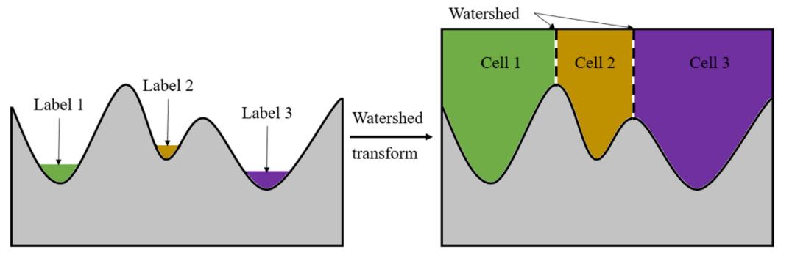

A imagem acima foi retirada do trabalho de Zheng, Tao, et al [4].

### Testes Realizados

Considerando o funcionamento da segmentação por watershed, existem dois objetivos a serem cumpridos:

* transformar a região de interesse, neste caso o CC, em uma bacia;
* determinar ao menos um ponto no interior da região de interesse para ser utilizado como marcador.

Inicialmente fiz alguns testes aplicando o watershed diretamente na imagem de MR e após apenas a aplicação de um filtro. Com isso eu esperava ganhar um melhor entendimento do comportamento do algoritmo, parte disso pode ser visto neste [notebook](notebooks/WatershedTest-00.ipynb).

#### 1° Teste
O primeiro teste mais elaborado que realizei seguiu o seguinte procedimento:

* aplicar threshold manualmente na imagem;
* calcular a distância dos pontos selecionados no threshold para o background;
* coletar os pontos de máximo e mínimo globais dessas distâncias (obviamente o mínimo é sempre 0) e utilizar eles como marcadores para o watershed;
* aplicar o watershed no negativo das distâncias, usando os marcadores definidos;
* usar funções morfológicas para retirar pequenos objetos e fechar pequenos buracos.

O código deste teste pode ser visto [aqui](notebooks/WatershedTest-01.ipynb). Com isso obtive resultados como:

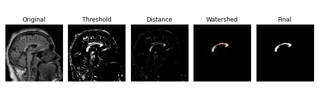

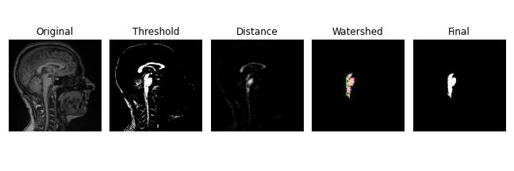

São resultados muito promissores, mas, como podemos ver na segunda imagem, quando o CC e o tronco encefálico não são bem separados no threshold é este último que acaba sendo segmentado.

#### 2° Teste

A partir do  primeiro teste decidi que o próximo passo seria melhorar o processo de threshold. Considerei que seria interessante criar um método semi-automático de segmentação, no qual o usuário precisaria apenas clicar em um pixel da imagem que esteja contido no CC. Para fazer isto utilizei as funções de High-level GUI do OpenCV [5] e o código pode ser visto neste [notebook](notebooks/WatershedTest-02.ipynb). Ao meu ver este método apresenta dois problemas, embora funcione bem, que são: necessitar de interação com o usuário e ser consideravelmente sensível a esta interação. Veja o resultado deste método aplicado duas vezes à mesma imagem, a única diferença está no pixel fornecido pelo usuário:

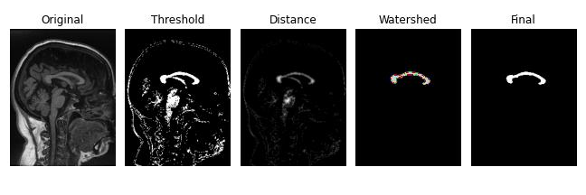

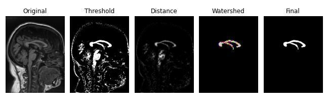

#### 3° Teste
Para conseguir um método de segmentação completamente automático passei a tentar utilizar do conhecimento aproximado da posição do CC na imagem. A ideia consiste em recortar a região da imagem em que o CC geralmente se encontra, então aplicar um filtro de média a essa sub-imagem e coletar seu pixel mais brilhante (a partir dele seguimos os mesmos passos de anteriormente). Esse método funciona bem em grande parte das imagens, mas, graças a variações anatômicas e do posicionamento do paciente, ele ainda acaba selecionando outras estruturas com certa frequência. O notebook deste teste pode ser acessado [aqui](notebooks/WatershedTest-03.ipynb). Veja como o pixel é selecionado (destacado em azul) e o resultados obtidos em casos de sucesso e falha:

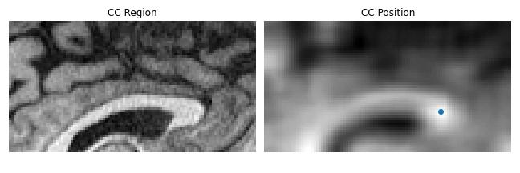
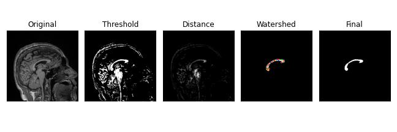
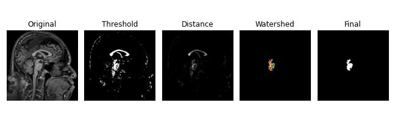

#### 4° Teste
O último teste realizado dá continuidade ao visto acima, mas desta vez tenta primeiro realizar a segmentação do tronco encefálico (TE) para usá-lo como ponto de referência para a segmentação do CC. Esta ideia é interessante pois a posição do TE varia menos do que a do CC e, além disso, ele é muito extenso verticalmente, o que pode ser explorado por um filtro de média retangular. Então o algoritmo segue como:

* determinar um ponto no interior do TE;
* segmentar o TE com o watershed;
* definir a região que contém o CC a partir do "topo" do TE;
* determinar um ponto no interior do CC;
* segmentar o CC com o watershed

O código deste teste está disponível [aqui](notebooks/WatershedTest-04.ipynb) e gera resultados como os das imagens abaixo. A primeira imagem mostra o processo de segmentação do TE, embora ele não determine todo o contorno da estrutura o resultado é suficiente para obter a posição aproximada do CC.

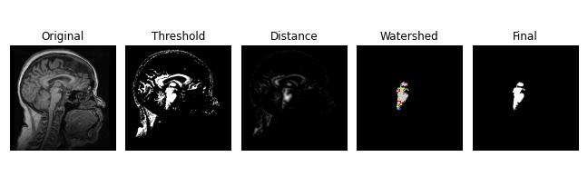
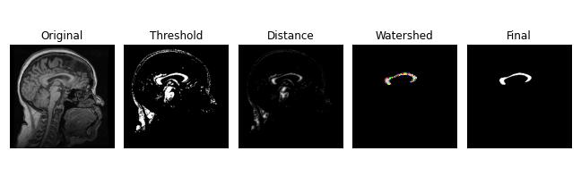

-----------------
## Resultados Finais

Para obter alguma informação quantitativa sobre o nível de sucesso deste projeto, comparei os resultados do método semi-automático e do último método automático com resultados gerados pelo [BrainGPS](https://braingps.mricloud.org/). Este site prove serviços de processamento de imagens médicas em nuvem, o que foi utilizado aqui foi o de segmentação T1-MultiAtlas. Foram enviadas 12 imagens escolhidas aleatoriamente para serem processadas, sendo duas de cada conjunto disponível no Calgary-Campinas 359.

A métrica utilizada foi o Intersection over Union (IoU), ou seja, calcula-se a razão entre o número de pixels que aparece em ao menos uma imagem com o número de pixels que aparece em ambas. É evidente que o IoU de duas segmentações estará sempre entre 0 e 1, sendo que 0 representa uma falha completa e 1 representa uma sobreposição perfeita. Veja abaixo a tabela com os resultados:

| img_name               | Semi-Automatic IoU | Automatic IoU      |
|------------------------|--------------------|--------------------|
| CC0005_philips_15_62_M | 0.8553092182030338 | 0.8707093821510298 |
| CC0044_philips_15_36_M | 0.8236889692585895 | 0.8240495137046862 |
| CC0074_philips_3_53_F  | 0.8643790849673203 | 0.8771331058020477 |
| CC0114_philips_3_60_M  | 0.8865497076023392 | 0.8650234741784038 |
| CC0141_siemens_15_53_F | 0.8779174147217235 | 0.8600746268656716 |
| CC0144_siemens_15_43_M | 0.8629173989455184 | 0.8811188811188811 |
| CC0232_siemens_3_56_M  | 0.7258536585365853 | 0.7202323330106486 |
| CC0238_siemens_3_58_M  | 0.3232758620689655 | 0.4594953519256308 |
| CC0263_ge_15_51_M      | 0.8619186046511628 | 0.8619186046511628 |
| CC0281_ge_15_56_M      | 0.8754325259515571 | 0.8606271777003485 |
| CC0318_ge_3_52_F       | 0.8747993579454254 | 0.8638573743922204 |
| CC0338_ge_3_51_M       | 0.2821959979476655 | 0.8097412480974124 |

Veja os dois casos que tiveram os piores resultados e um exemplo de bom resultado:
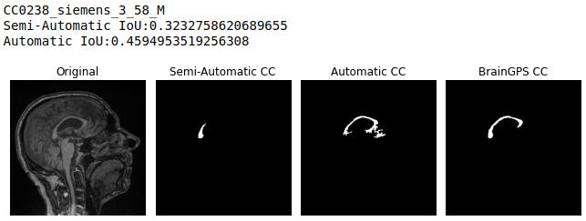
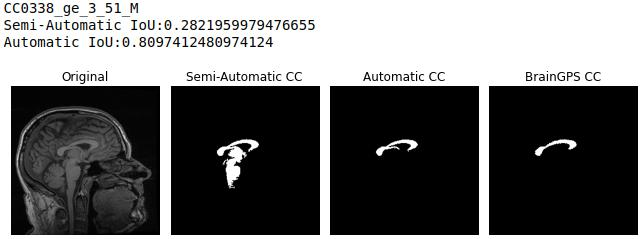
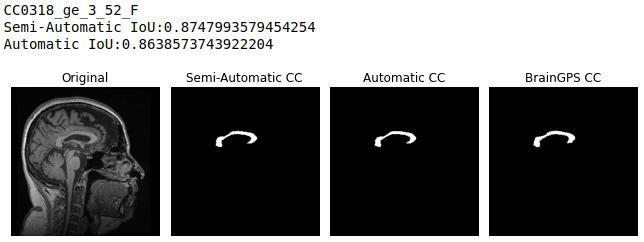

-----------------
## Discussão
Levando em consideração o tempo que pode ser investido neste projeto, acredito ter conquistado bons resultados. Infelizmente minha busca inicial em artigos por técnicas que pudessem me ajudar não gerou muitos frutos. Isto aconteceu pois a maioria dos artigos que utiliza watershed para segmentar o CC o aplica em imagens ponderadas em difusão [6] ou em conjunto com dados estatísticos gerados pela análise de médicos [7], e não tenho acesso a ambos.

Só recentemente busquei por artigos que faziam a segmentação do CC em imagens ponderadas em T1 (sendo que estes não utilizam o watershed), o que acredito ter sido um grande erro. Durante esta busca encontrei um artigo que utilizava um algoritmo de "Adaptive Mean Shift Clustering" que conseguia separar o CC muito bem [8], veja a imagem abaixo (retirada do artigo de Li, Yue, Mrinal Mandal, e S. Nizam Ahmed):

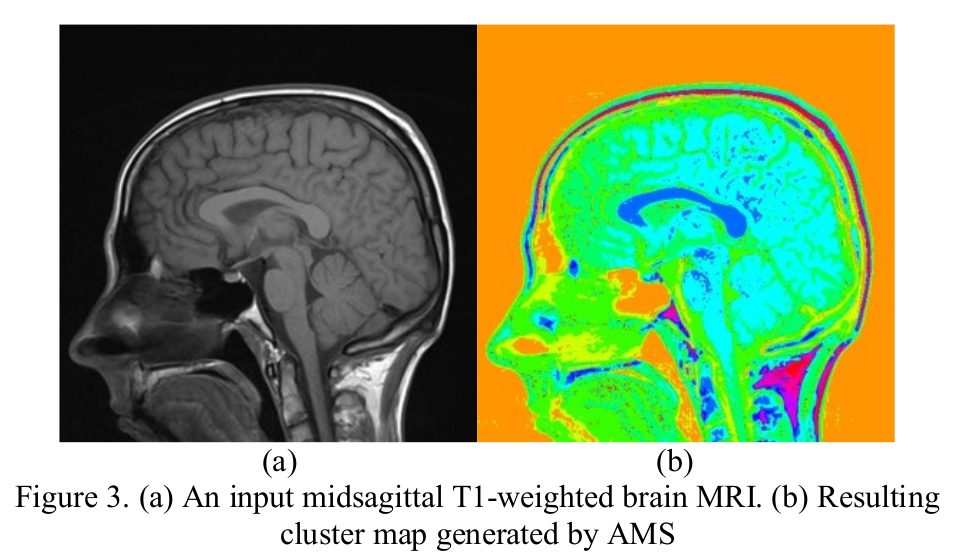

Acredito que combinar este algoritmo com o watershed geraria ótimos resultados e, definitivamente, seguiria esta rota se houvesse mais tempo há ser dedicado ao projeto.

----------------
## Referências Bibliográficas

[1] O'Dwyer, R., et al. "Differences in corpus callosum volume and diffusivity between temporal and frontal lobe epilepsy." Epilepsy & Behavior 19.3 (2010): 376-382.

[2] Hampel, Harald, et al. "Corpus callosum atrophy is a possible indicator of region–and cell type–specific neuronal degeneration in Alzheimer disease: A magnetic resonance imaging analysis." Archives of neurology 55.2 (1998): 193-198.

[3] [Scikit-image Documentation - Watershed Segmentation](https://scikit-image.org/docs/0.19.x/auto_examples/segmentation/plot_watershed.html)

[4] Zheng, Tao, et al. "Research on distance transform and neural network lidar information sampling classification-based semantic segmentation of 2d indoor room maps." Sensors 21.4 (2021): 1365.

[5] [OpenCV Documentation - High-level GUI](https://docs.opencv.org/3.4/d7/dfc/group__highgui.html)

[6] Freitas, Pedro, et al. "Watershed-based segmentation of the midsagittal section of the corpus callosum in diffusion MRI." 2011 24th SIBGRAPI Conference on Graphics, Patterns and Images. IEEE, 2011.

[7] Hamarneh, Ghassan, and Xiaoxing Li. "Watershed segmentation using prior shape and appearance knowledge." Image and Vision Computing 27.1-2 (2009): 59-68.

[8] Li, Yue, Mrinal Mandal, and S. Nizam Ahmed. "Fully automated segmentation of corpus callosum in midsagittal brain MRIs." 2013 35th Annual International Conference of the IEEE Engineering in Medicine and Biology Society (EMBC). IEEE, 2013.