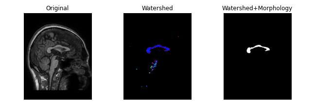
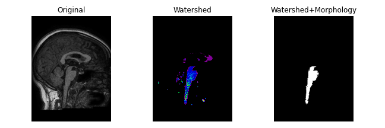
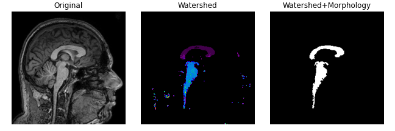
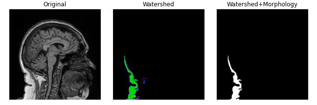

# `Segmentação de Corpo Caloso`
# `Corpus Callosum Segmentation`

## Apresentação

 

O presente projeto foi originado no contexto das atividades da disciplina de pós-graduação *EA979A - Introdução a Computação Gráfica e Processamento de Imagens*, 
oferecida no primeiro semestre de 2022, na Unicamp, sob supervisão da Profa. Dra. Paula Dornhofer Paro Costa, do Departamento de Engenharia de Computação e Automação (DCA) da Faculdade de Engenharia Elétrica e de Computação (FEEC).
 

|Nome  | RA | Curso|
|--|--|--|
|Lucas Lopes Maldonado  | 220819  | Física Médica|
--------------------------
## Descrição do Projeto

 

O objetivo deste projeto é realizar a segmentação de corpo caloso em 3D utilizando o método de watershed. O corpo caloso (CC) é maior estrutura de matéria branca e tem importante papel clínico e na pesquisa por sua forma e volume terem correlação com características do indivíduo e doenças neurodegenerativas.

Pretendo utilizar o watershed já implementado por algum pacote, como o scikit-image, portanto o projeto está focado na determinação de quais pré e pós-processamentos serão necessários para atingir uma boa segmentação.

Caso obter bons resultados em 3D se revele muito difícil irei migrar para 2D (midsagittal slice). Nesse caso há a adição de um nova etapa ao projeto, que é a determinação da "midsagittal slice". 

--------------------------
## Plano de Trabalho

* Etapa 1 (Concluída): Obtenção de imagens 

Irei utilizar o dataset público de imagens de ressonância magnética [Calgary-Campinas 359](https://sites.google.com/view/calgary-campinas-dataset/home). 

* Etapa 2 (1~2 dias): Processamento de imagens no [BrainGPS](https://braingps.mricloud.org/). 
  
Algumas imagens do dataset serão selecionadas e preparadas para submissão no BrainGPS. Este site possui uma função para segmentar diversas estruturas do cérebro. Ao final do projeto, será feita uma comparação entre meus resultados e os do BrainGPS.
 
* Etapa 3 (1 semana): Estudo do watershed

Será feito um estudo do funcionamento deste algoritmo. Se possível, será feita uma análise da implementação do scikit-image (ou outro pacote).

* Etapa 4 (2 semanas): Leitura de artigos

Buscarei artigos que descrevam os pré e pós-processamentos utilizados em conjunto com o watershed para a segmentação de corpo caloso (e estruturas similares)

* Etapa 5 (4 semanas): Experimentação

Irei testar quais resultados podem obtidos com as técnicas estudadas até aqui. Será um bom momento para reavaliar os objetivos do projeto.

* Etapa 6 (1 semanas): Codificação

Assumindo que a Etapa 5 teve bons resultados, será criado o código final do projeto com os métodos escolhidos.

* Etapa 7 (1 semana): Comparação de Resultados

Irei comparar os resultados obtidos entre meu código final e o BrainGPS

* Etapa 8 (1 semana): Escrita do Relatório

-----------------
## Resultados Parciais

 O maior problema enfrentado até o momento é o fato de que os artigos que encontrei utilizam recursos aos quais não tenho acesso, alguns deles utilizam imagens do tipo DTI, outros extraem propriedades de imagens já segmentadas por médicos. Por conta disso, decidi aumentar o tempo gasto na fase de experimentação com os métodos de segmentação para quatro semanas.

 Felizmente obtive bons resultados com um dos métodos testados (pode ser visto neste [notebook](https://github.com/lucaslmaldonado/corpus_callosum_segmentation/blob/main/notebooks/2DWatershedTest.ipynb)), embora ele ainda precise ser refinado. Por enquanto ele foi testado apenas na fatia sagital central da imagem e depende de um tresholding manual. Quando o tresholding não está bem ajustado para imagem outros objetos são selecionados. Veja abaixo um caso de segmentação bem sucedida e três casos em outros objetos foram selecionados:

 
 
 
 

 Perceba que em todos os casos as bordas dos objetos sementados ainda são grosseiras.

 Quando os resultados em 2D estiverem mais refinados tentarei aplicar o método em cada fatia da imagem 3D, com isso espero obter a segmentação tridimensional.  

----------------
## Referências Bibliográficas

Rittner, Leticia, et al. "Automatic DTI-based parcellation of the corpus callosum through the watershed transform." Revista Brasileira de Engenharia Biomédica 30.2 (2014): 132-143.

Freitas, Pedro, et al. "Watershed-based segmentation of the midsagittal section of the corpus callosum in diffusion MRI." 2011 24th SIBGRAPI Conference on Graphics, Patterns and Images. IEEE, 2011.

Hamarneh, Ghassan, and Xiaoxing Li. "Watershed segmentation using prior shape and appearance knowledge." Image and Vision Computing 27.1-2 (2009): 59-68.

Bueno, Gloria, et al. "3D watershed-based segmentation of internal structures within MR brain images." Medical Imaging 2000: Image Processing. Vol. 3979. International Society for Optics and Photonics, 2000.

Cover, G. S., et al. "Computational methods for corpus callosum segmentation on MRI: a systematic literature review." Computer methods and programs in biomedicine 154 (2018): 25-35.

Adamson, C., Beare, R., Walterfang, M. et al. Software Pipeline for Midsagittal Corpus Callosum Thickness Profile Processing. Neuroinform 12, 595–614 (2014).

Bueno, G., et al. "Three-dimensional segmentation of anatomical structures in MR images on large data bases." Magnetic Resonance Imaging 19.1 (2001): 73-88.

[Scikit-image Documentation](https://scikit-image.org/docs/stable/)

[Numpy Documentation](https://numpy.org/doc/stable/index.html)

[Scipy Documentation](https://scipy.github.io/devdocs/index.html)